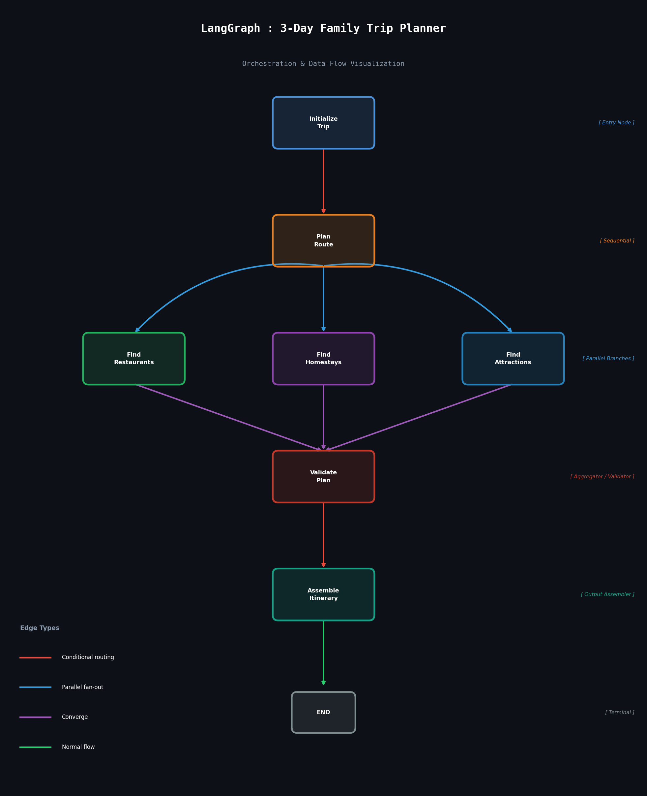

# 🤖 Orchestrate AI Agents — Beginner's Dive

> A hands-on demonstration of **multi-agent AI orchestration** using [LangGraph](https://github.com/langchain-ai/langgraph), featuring a real-time family trip planner with a premium Next.js chat interface.

---

## 🌟 What Is This?

This project shows how to **orchestrate multiple AI agents** in a structured workflow using LangGraph — a framework built on top of LangChain for building stateful, multi-actor applications. The demo use case is **TripMind**, an AI-powered family trip planner that:

- Accepts a natural-language trip request
- Runs **7 specialized agents** in a directed graph
- Executes 3 of those agents **in parallel** for speed
- Assembles a complete day-by-day itinerary
- Displays results in a premium dark-themed chat UI

---

## 🏗️ Architecture Overview

```
     +---------------------+
     |   initialize_trip   |  ← Entry Node (validates inputs)
     +----------+----------+
                | (conditional routing)
     +----------v----------+
     |      plan_route     |  ← Sequential (driving itinerary)
     +--+----------+----+--+
        |          |    |       ← parallel fan-out →
  +-----v--+  +----v--+  +----v-----------+
  |  find_ |  | find_ |  | find_          |
  |restaurants| |homestays| | attractions   |
  +-----+--+  +----+--+  +----+-----------+
        |          |          |       ← converge →
     +--v----------v----------v--+
     |        validate_plan       |  ← Aggregator (quality checks)
     +----------+-----------------+
                | (conditional routing)
     +----------v----------+
     |  assemble_itinerary |  ← Output Assembler
     +----------+----------+
                |
              [END]
```

### Graph Node Types

| Node | Type | Description |
|------|------|-------------|
| `initialize_trip` | Entry | Validates inputs & seeds state |
| `plan_route` | Sequential | Builds driving route with rest stops |
| `find_restaurants` | **Parallel** | Schedules meals for all days |
| `find_homestays` | **Parallel** | Finds family-friendly accommodations |
| `find_attractions` | **Parallel** | Discovers tourist activities |
| `validate_plan` | Aggregator | Quality-checks all collected data |
| `assemble_itinerary` | Output | Merges everything into a day-by-day plan |

---

## 🚀 Project Structure

```
orchestrate-ai-agents/
├── trip_planner.py          # Core LangGraph backend (Python)
├── itinerary_output.json    # Sample output from a run
├── trip_planner_graph.png   # Auto-generated graph visualization
└── chat-ui/                 # Next.js 15 frontend (TripMind)
    ├── app/
    │   ├── page.tsx         # Main chat interface component
    │   ├── globals.css      # Dark-theme design system
    │   ├── layout.tsx       # Root layout & metadata
    │   └── api/plan/
    │       └── route.ts     # API route bridging UI ↔ Python backend
    ├── public/              # Static assets
    ├── package.json
    └── tsconfig.json
```

---

## 🧠 Key LangGraph Concepts Demonstrated

### 1. Typed State with Reducers
```python
class TripState(TypedDict):
    destination:  str
    route_plan:   Dict[str, Any]          # written by one node
    restaurants:  List[Dict[str, Any]]    # written by one node
    execution_log: Annotated[List[str], operator.add]  # reducer — all nodes append
    status:       str
```
Fields written by **multiple parallel branches** use `Annotated[T, reducer]` to merge safely.

### 2. Conditional Routing
```python
def route_after_init(state: TripState) -> str:
    return "plan_route" if state["status"] == "initialized" else END
```
Nodes can route to different next nodes based on state — or exit early on errors.

### 3. Parallel Fan-out → Converge
```python
graph.add_edge("plan_route", "find_restaurants")
graph.add_edge("plan_route", "find_homestays")
graph.add_edge("plan_route", "find_attractions")
# All 3 converge back to:
graph.add_edge("find_restaurants", "validate_plan")
graph.add_edge("find_homestays",   "validate_plan")
graph.add_edge("find_attractions", "validate_plan")
```
Three agents run **simultaneously** in a super-step, then their results are merged automatically.

---

## 💻 TripMind — Chat UI

The `chat-ui/` is a **Next.js 15** app with a premium dark-themed interface:

- 💬 **Chat interface** — natural language trip requests
- ⚡ **Live step progress** — shows all 7 graph nodes animating in real-time
- 🗺️ **Tabbed itinerary view** — Overview, Route, Weather, Day-wise, Homestays
- 🌤️ **Weather integration** — Real forecast data via Open-Meteo API (no key needed)
- 🛣️ **Route data** — Real routing via OSRM API
- 📱 **Quick prompts** — Pre-built trip templates for one-click planning

### UI Screenshot Flow

```
User types trip request
       ↓
7-node progress bar animates (Initialize → Plan → Parallel → Validate → Assemble)
       ↓
Rich itinerary rendered with tabs:
  📊 Overview | 🛣️ Route | 🌤️ Weather | Day 1 | Day 2 | Day 3 | 🏡 Stays
```

---

## ⚙️ Setup & Running

### Prerequisites
- Python 3.10+
- Node.js 18+
- `pip` and `npm`

### 1. Python Backend

```bash
# Create and activate virtual environment
python3 -m venv venv
source venv/bin/activate        # macOS/Linux
# venv\Scripts\activate         # Windows

# Install dependencies
pip install langgraph langchain matplotlib

# Run the planner (standalone demo)
python trip_planner.py
```

This will:
- Execute the full LangGraph workflow
- Print a detailed itinerary to the terminal
- Save `itinerary_output.json`
- Generate `trip_planner_graph.png` (graph visualization)

### 2. Next.js Chat UI

```bash
cd chat-ui
npm install
npm run dev
```

Open [http://localhost:3000](http://localhost:3000) — the chat UI will be live.

> The UI calls `/api/plan` which bridges to the Python backend. Make sure the Python environment is active in the same shell or adjust the API route to call the backend endpoint.

---

## 📦 Sample Output

After running `trip_planner.py`, a structured itinerary is saved to `itinerary_output.json`:

```json
{
  "trip_summary": {
    "destination": "Coorg, Karnataka",
    "origin": "Bengaluru",
    "num_days": 3,
    "num_travellers": 4
  },
  "travel_route": {
    "total_distance_km": 270,
    "estimated_drive_hours": 5.0,
    "highway": "NH-275 (Bengaluru–Mysuru Expressway + Kushalnagar)"
  },
  "days": {
    "Day 1": { "meals": [...], "activities": [...], "accommodation": {...} },
    "Day 2": { ... },
    "Day 3": { ... }
  },
  "all_homestay_options": [...]
}
```

---

## 🗺️ Graph Visualization

Running `trip_planner.py` auto-generates `trip_planner_graph.png` — a dark-themed PNG showing all nodes, edge types, and data flow:



**Edge color legend:**
- 🔴 Red — Conditional routing
- 🔵 Blue — Parallel fan-out
- 🟣 Purple — Converge
- 🟢 Green — Normal flow

---

## 🧩 LangGraph Concepts Quick Reference

| Concept | What It Does |
|---------|-------------|
| `StateGraph` | Defines the graph with typed state |
| `add_node` | Registers an agent function |
| `add_edge` | Defines fixed transitions |
| `add_conditional_edges` | Defines routing based on state |
| `set_entry_point` | Marks the first node |
| `Annotated[T, reducer]` | Merges values from parallel branches |
| `compile()` | Builds the runnable graph |
| `app.invoke(state)` | Executes the full graph |

---

## 🛠️ Tech Stack

| Layer | Technology |
|-------|-----------|
| AI Orchestration | [LangGraph](https://github.com/langchain-ai/langgraph) |
| Backend Language | Python 3.10+ |
| Graph Visualization | Matplotlib |
| Frontend Framework | Next.js 15 (App Router) |
| Frontend Language | TypeScript |
| Styling | Vanilla CSS (dark theme, glassmorphism) |
| Routing Data | [OSRM API](http://router.project-osrm.org) |
| Weather Data | [Open-Meteo API](https://open-meteo.com) |

---

## 📚 Learning Resources

- [LangGraph Documentation](https://langchain-ai.github.io/langgraph/)
- [LangGraph Concepts: Parallelism](https://langchain-ai.github.io/langgraph/concepts/low_level/#send)
- [LangGraph How-to Guides](https://langchain-ai.github.io/langgraph/how-tos/)

---

## 🤝 Contributing

This is a learning/demo project. Feel free to fork and extend it:
- Add real LLM calls (OpenAI, Gemini, etc.) to replace mock data
- Add more destinations and agent types
- Integrate a real database for storing itineraries
- Add user authentication to the chat UI

---

*Built as a beginner's dive into AI agent orchestration with LangGraph.*
